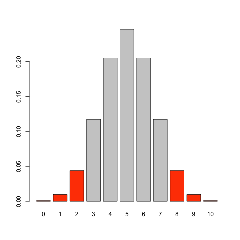

## 要旨

R の

## 前置き: p 値について（再）入門するための手短な例


[統計的有意性と P 値に関する ASA 声明　(PDF 直リンク)](https://www.biometrics.gr.jp/news/all/ASA.pdf) には,「おおざっぱにいうと、P 値とは特定の統計モデルのもとで、データの統計的要約（たとえば、2 グループ比較での標本平均の差）が観察された値と等しいか、それよりも極端な値をとる確率である。」と記されている.

数式を使ってこの文を書き下してみよう.

統計モデルのパラメータ を$\theta_0$ とし, データの統計的要約, すなわちデータ $X$ の関数である **検定統計量** を $T(X)$ とする. 検定統計量 $T(X)$ が観測された値 $t$ の出る確率かそれより小さい確率になる確率の総和

$$
p = \sum_t P_{\theta_0}(T(X) \le t) \tag{1}
$$

が p 値である.


通例は, 

1. 連続型の確率分布も含めるために和ではなく積分を使い,
2. 帰無仮説が複数の点からなる場合も含めるために上界を使って

定義するので(1)式は統一的な定義ではない.

しかし第一歩として, (1)式を理解するための例をやってみる.

いま, 0または1の2値で表される変数　$X=(X_1, \ldots, X_n)$ に対して, $n=10$ の観測のうち9回が1だった

$$
T(X) = \sum_{i=1}^{n} X_i = 9
$$

としよう. 

「2値で表される変数」については病気のあり・なしとか, 成果のあり・なしといったイメージしやすいものをイメージして補ってほしい.

公平なコイントスのモデル, 確率パラメータ0.5の二項分布を使って p 値を計算してみる.

R のコード：

```r

pb <- dbinom(0:10, 10, 0.5)

t_p <- dbinom(9, 10, 0.5)

cols = ifelse(pb <= t_p, "orangered", "grey80")
png("binom_barplot.png")
barplot(pb, names.arg = 0:10, col=cols)
dev.off()


cat("p-value (by definition): ", sum(pb[pb <= t_p]), "\n")
```



```r
> cat("p-value (by definition): ", sum(pb[pb <= t_p]), "\n")
p-value (by definition):  0.02148438 
```

検定統計量 $T(X)=9$ が観測された値 $t$ の出る確率かそれより小さい確率になる確率の総和

棒グラフの赤いところをすべて足し合わせている.

この計算は R では `binom.test` という関数で実装されている：

```r
res0_b <- binom.test(x = 9, n = 10, p = 0.5)
cat("p-value (binom.test): ", res0_b$p.value, "\n")

print(res0_b)
```

実行してみると同じ結果が得られると思う.


ここで再度 [統計的有意性と P 値に関する ASA 声明　(PDF 直リンク)](https://www.biometrics.gr.jp/news/all/ASA.pdf) にあたって,「P 値はデータと特定の統計モデル（訳注:仮説も統計モデルの要素のひとつ）が矛盾する程度をしめす指標のひとつである。」という一文に着目してみよう.

p値が小さいほど「矛盾の程度が大きい」のだから帰無仮説を動かしてp値を計算したら「矛盾の程度がそれなりに小さい仮説」や「矛盾の程度がそこそこの仮説」も知れるだろうというモチベーションが生まれる.

今回パラメータの取りうる値の範囲が0から1までなので総当たりでもさほど大変ではない.

```r
z <- seq(0.1, 0.99, by=0.005)
pv_b <- sapply(z, function(p)binom.test(8, 10, p = p)$p.value)

ggplot(data = NULL)+
  geom_line(aes(x=z, y=pv_b))+
  geom_errorbarh(aes(y=0.05/2, xmin = res0_b$conf.int[1], xmax=res0_b$conf.int[2]),
                 height=0.03, colour="cornflowerblue")+
  theme_bw(16)+
  labs(x="param.", y="p-value", colour="method", linetype="method")
#ggsave("pvfun_b.png")

```


ところで `binom.test` の結果には ``

```r
> print(res0_b)

	Exact binomial test

data:  9 and 10
number of successes = 9, number of trials = 10, p-value =
0.02148
alternative hypothesis: true probability of success is not equal to 0.5
95 percent confidence interval:
 0.5549839 0.9974714
sample estimates:
probability of success 
                   0.9 
```

検定の場合の "Exact" は大体の場合「サンプルサイズが大きいときに成り立つ近似を使わない」程度の意味であることが多い.


最初に引いた『現代数理統計学の基礎』には

と書かれているが尤度比検定やスコア検定でも信頼区間を与えることができた. 


パラメータ$\theta_0$ を（例えば中央値=0のような形で）1つ決めたとしてもどんな確率分布で確率を測るかは決まらないので「特定の統計モデルのもとで」という断り書きが必要になる(パラメータ付きの確率分布で考えておくと, 例えば分布の仮定から多少外れていたときにp値がどうなるかといったロバストネスの議論などがしやすくなる)


